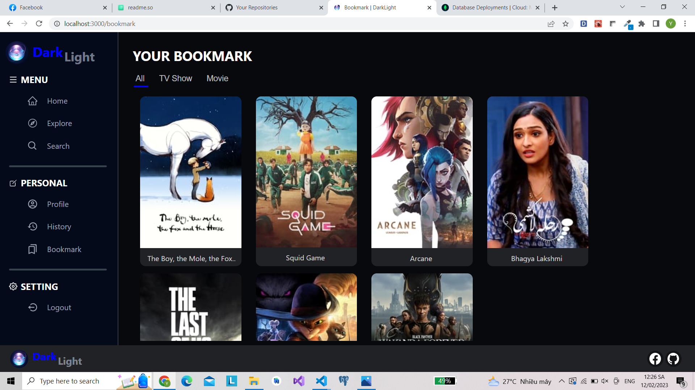

# [WEB] DARKLIGHT

## 🛠 Introduction

Here is my source code for website. With my code: 
* **web uses TMDB API and NodeJS server stores data from buttDB.**
* **When users log in to the system, they will be able to use the following functions: view profiles, add and delete bookmarks, save and display movie viewing history information.**
* **Users can comment, reply and like comments realtime.**
* **Update information about genres, trending, top rate... of movies and tv shows.**
* **Search (with suggestions) by movie name, tv show, actor...**
* **View detailed information about casts, ratings, time, reviews, seasons, ... of each movie/tv show that the user wants.**
* **Responsive interface to each device and user permissions.**

### 🛠 Demo:
<a href="https://darklight-rfl3.onrender.com">https://darklight-rfl3.onrender.com</a>

## 🛠 Languages:

 &nbsp;
 &nbsp;
 &nbsp;
 &nbsp;

## 🛠 Main pages of the website

### Home page:

   
  <i>Home page</i>

   
  <i>Describe the function of Home page</i>

### Detail page:

   

   
  <i>Describe the function of Detail page</i>

### Watch page:

   

   
  <i>Describe the function of Watch page</i>

### Comment realtime:

   

   
  <i>Comment</i>

### Explore page:

   

   
  <i>Describe the function of Explore page</i>

### Search page:

   

   
  <i>Describe the function of Search page</i>

### History page:

   

   
  <i>Describe the function of History page</i>

### Bookmark page:

   

   
  <i>Describe the function of Bookmark page</i>

